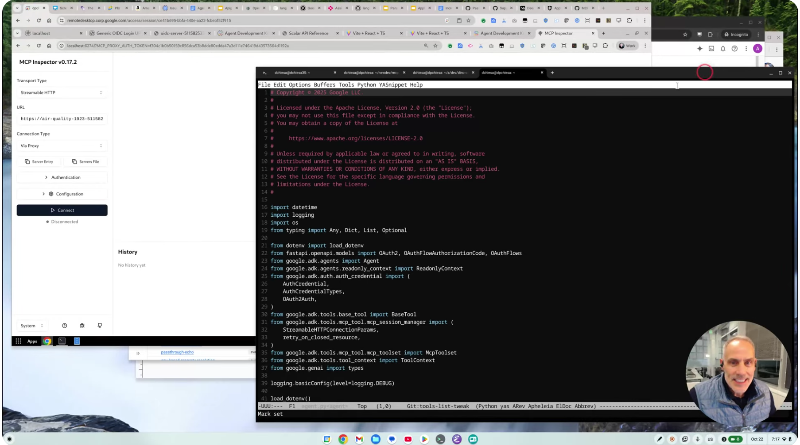

# Governed MCP Example - Air Quality Server

I built this to illustrate governance
that I can apply on any MCP Server that can be accessed over HTTP, through Apigee.

This repo contains:
- an example MCP Server implemented in python, using [the FastMCP framework from
  jlowin](https://github.com/jlowin/fastmcp). The server provides air quality
  sensor readings for places. The server does not perform any authorization
  check.

- an example Apigee API Proxy, that acts as a facade for that Server, providing
  the authorization check and a 401 WWW-Authenticate interception.


## Disclaimer

This example is not an official Google product, nor is it part of an
official Google product.

## Screencast

[This Screencast](https://youtu.be/za69HZuhNiE) walks through the process.
[](https://youtu.be/za69HZuhNiE)

## Using it

You can do it yourself.

To set this up, you need a GCP project suitable for Cloud Run, and an Apigee
instance. You need the proper roles and permissions:
 - to create service accounts,
 - deploy services to Cloud Run,
 - create and manage secrets in Secret Manager
 - and import + deploy Apigee proxies.

The setup scripts use things like apigeecli, and gcloud.

### Prerequisites

1. You will need to obtain credentials (API Keys) for the TomTom and Open Air
   Quality services by visiting:

   - https://developer.tomtom.com/
   - https://docs.openaq.org/

2. You also need an API Key for Gemini. Get one at https://ai.studio

3. You need to set up an OpenID Connect IDP, and provision a new
   Client ID and Secret pair. Steps for this varies, depending on
   your IDP. For setting up Auth0, you can try [these steps](./Auth0-setup.md).
   
   This example will work with any OIDC-compliant IDP, but I don't have the
   specific steps for each IDP.


### Service and Proxy Provisioning Steps

0. With a text editor, open the [env-sample.txt](./env-sample.txt) file,
   modify it to use your settings, and save it, to a file, perhaps named `.env`.

1. Open a terminal window.
   _Source_ the file to get all of those settings into your environment.
   ```sh
   source .env
   ```

1. Create the service account for the Cloud Run service.
   ```sh
   ./1-create-service-account-for-mcp-server.sh
   ```

2. Provision the secrets into Secret Manager. These include the
   TomTom and OpenAQ keys.
   ```sh
   ./2-provision-secrets.sh
   ```

3. Deploy the MCP Server to Cloud Run
   ```sh
   ./3-deploy-mcp-to-cloud-run.sh
   ```

   You should now be able to interact with the MCP Server
   at the endpoint emitted by the deployment script.

   You can use the [MCP Inspector](https://modelcontextprotocol.io/docs/tools/inspector) to do this.


   Or, to use [Gemini CLI](https://github.com/google-gemini/gemini-cli), open or create the file `~/.gemini/settings.json` and
   provide this configuration:
   ```json
   {
     "mcpServers": {
       "air-quality": {
         "httpUrl": "https://air-quality-1923-999999222.us-west1.run.app/mcp"
       }
     }
     ....
   }
   ```
   Replace the URL with the one from your Cloud Run service. Then, start Gemini CLI and you should be
   able to interact with the MCP Server.

   You can also use VSCode as the MCP Client.  In that case, use this for your MCP configuration: 
   ```
   {
     "servers": {
       "air-quality": {
         "url": "https://air-quality-1923-999999222.us-west1.run.app/mcp"
         "type": "http"
       }
     },

     "inputs": []
   }
   ```

4. If you do not already have it, install the `apigeecli`
   ```sh
   ./8-install-apigeecli.sh
   ```

4. Import and deploy the Apigee proxy:
   ```sh
   ./9-import-and-deploy-apigee-proxy.sh
   ```

   At this point, if you configure the Apigee proxy as the MCP endpoint, you
   will see the OpenID Connect signin at the appropriate time.

   To do this with Gemini CLI, modify the  `~/.gemini/settings.json` file to
   provide this configuration:
   ```json
   {
     "mcpServers": {
       "air-quality-oauth": {
         "httpUrl": "https://apigee.endpoint.for.you/air-quality-oauth/mcp",
         "timeout": 4400,
         "oauth": {
           "enabled": true,
           "clientId": "OPENID_CLIENT_ID",
           "clientSecret": "OPENID_CLIENT_SECRET",
           "audiences": ["air-quality-oauth"]
         }
       }
     }
     ....
   }
   ```
   
   Replace the URL with the one from your Apigee proxy, and use the appropriate
   CLIENT ID and Secret from your OpenID IDP. Then, re-start Gemini CLI and type
   `/mcp auth air-quality-oauth`, and you'll see the signin, and afterwards you
   will be able to interact with the service.

   If you are using VSCode as the MCP client, stop and restart VSCode, and when
   you start the MCP server, you will see the signin experience. For VScode you
   do not need to modify the mcp.json file, but _you will need to interactively
   supply the client ID and Secret_ at runtime.

## Discussion

This is just an example. It illustrates the basics. Probably you will want to
extend this idea for your purposes. Here are some ideas:

1. **Multiple MCPs**. While this example shows a single API Proxy acting as a
   facade for a single MCP Server, in the general case companies will have lots of
   MCP servers. Using wildcard basepaths and a simple lookup table, it's trivial to
   use a single API Proxy as a facade for a large number of MCP Servers.

3. **API Product check**.  By including a VerifyAPIKey policy into the API
   Proxy, you can also check the entitlement of the client for a particular API
   Product.

2. **User-based Authorization check**. By including a ServiceCallout to a policy
   decision point (Something like OPA), you could include fine-grained dynamic
   authorization check in the Apigee proxy.


## License

This material is [Copyright © 2025 Google LLC](./NOTICE).
and is licensed under the [Apache 2.0 License](LICENSE).

## Support

This example is open-source software. If
you need assistance, you can try inquiring on [the Google Cloud Community forum
dedicated to Apigee](https://goo.gle/apigee-community) There is no service-level
guarantee for responses to inquiries posted to that site.
